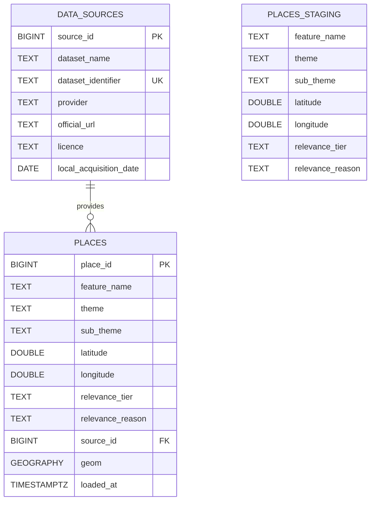

# Database ER Diagram

The database uses three main tables. The processed CSV is loaded into `places_staging` first. The checked data is then moved into `places`.

## Table purpose

- `data_sources` records where the data came from.
- `places_staging` temporarily stores the processed CSV rows.
- `places` stores the checked place records and PostGIS points.
- `discovery_places` is a view containing only Tier 1 places.

One data source can provide many place records. Each place record belongs to one data source.